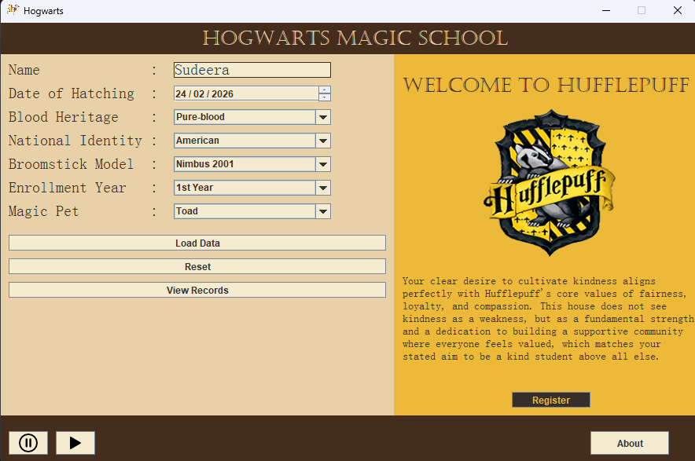

# 🧙‍♂️ Hogwarts Magic School

A dynamic, interactive desktop application built with Java Swing that registers university students and uses Artificial Intelligence to sort them into their rightful Hogwarts House.

This project was developed as an educational mini-project to demonstrate Object-Oriented Programming (OOP), GUI state management, and secure external REST API integration in Java.

---

## ✨ Key Features

* **Interactive GUI:** Fully custom graphical user interface built from scratch using Java Swing (Absolute Layout), featuring custom background images and themed Hogwarts components.
* **Student Registration:** A data-entry form to collect the student's name and details before the sorting ceremony begins.
* **AI-Powered Sorting:** Integrates with the OpenRouter AI API (`stepfun/step-3.5-flash:free` model) to analyze the student and dynamically assign them to Gryffindor, Slytherin, Ravenclaw, or Hufflepuff with personalized reasoning.
* **Dynamic Visuals:** A real-time loading progress bar and dynamic result screens that change colors and images based on the AI's final decision.
* **Audio & Theming:** Integrated sound management (`SoundManager.java`) and custom Hogwarts UI themes (`hogwartsTheam.java`).
* **Seamless Application Reset:** A robust memory-management and reset system (`reset.java`) that safely clears the window, garbage-collects old panels, and returns the app to its exact default state for the next student.
* **Secure Credential Management:** Keeps API keys completely hidden and secure via a `.env` file using native Java properties.

---
##  The Sorting Hat (Ai powered)

This hat has a main task select the matched house for the student.
the magic school has four main clubs Gryffindor,Slytherin,Hufflepuff and Rawenclaw. So we use API intergration for select house. First we get User input "Who are you" then passed this parramiter to Ai model process and get the output House and what are the resons selected to house SO thats main process this ai part.


---
## 📸 Screenshots

*(Add screenshots of your application here!)*




---

## 🛠️ Tech Stack

* **Language:** Java (JDK 8+)
* **GUI Framework:** Java Swing / AWT
* **Environment Management:** Native `java.util.Properties` for secure `.env` variable loading
* **External APIs:** REST HTTP requests for LLM text generation

---

## 📂 Project Structure

```text
HOGWARTS/
├── .vscode/              # VS Code workspace settings
├── bin/                  # Compiled Java .class files
├── img/                  # Visual assets (House crests, backgrounds, Hat image)
├── lib/                  # External library folder
├── res/                  # Application resources
├── resources/            # Additional resources
├── src/                  # Core Java source code
│   ├── About.java
│   ├── AISorthat.java        # Handles AI API connection and logic
│   ├── App.java              # Main entry point
│   ├── Footer.java
│   ├── Form.java             # Main registration input form
│   ├── hatpanel.java         # Sorting ceremony and progress UI
│   ├── Header.java
│   ├── hogwartsTheam.java    # Custom UI styling definitions
│   ├── houseBanner.java      # Dynamic result overlay display
│   ├── mainFrame.java
│   ├── panels.java
│   ├── register.java
│   ├── reset.java            # Memory cleanup and state reset logic
│   ├── resourcesLoad.java
│   ├── SoundManager.java     # Audio controller
│   └── studentsWindow.java
├── .env                  # Hidden environment variables (API Key)
├── .gitignore            # Git exclusion rules
└── README.md             # Project documentation